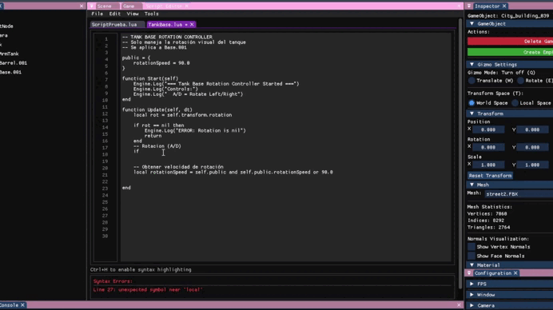
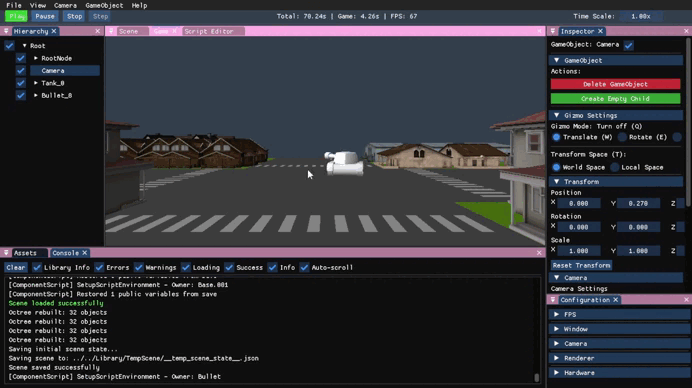

<h1 align="center">🌊 Wave Engine 🌊</h1>

  

 

  

 

 

This project is a custom 3D game engine developed in C++ using OpenGL as the main graphics API.  
It integrates several external libraries such as Assimp (for 3D model loading), DevIL (for texture management), and ImGui (for the user interface).

In version 2.0, we've evolved beyond simple FBX dependency, implementing a complete resource management system with custom file formats and significant rendering optimizations. The engine now features an advanced editor interface with scene serialization, resource management, and acceleration structures for optimal performance.

🔗 <strong>GitHub Repository:</strong> <a href="https://github.com/Audra0000/Engine">https://github.com/Audra0000/Engine</a>

---

## 🎏 Team Members

- **Haosheng Li** — [GitHub: HaosLii](https://github.com/HaosLii)  
- **Ana Alcaraz** — [GitHub: Audra0000](https://github.com/Audra0000)

---

## 🦀 Controls

| Action | Key 1 | Key 2 |
|------------|------------|------------|
| Up | Space | |
| Down | Left Ctrl | |
| Zoom | Mouse wheel | |
| Velocity ×2 | Hold Shift | |
| Free movement | Right Mouse Button | WASD |
| Orbit | Left Alt | Left Mouse Button |
| Focus | F | |
| Select | Left Mouse Button | |
| Multiple select | Shift | Left Mouse Button |
| Delete object | Backspace | |

| Gizmo Action | Key 1 | Key 2 |
|------------|------------|------------|
| Move | W | |
| Rotate | E | |
| Scale | R | |
| Toggle Coordinate System | T | |
---

## 🐠 User Interface

### **Console**
The console logs all engine events and processes, such as:
- Loading geometry (via **ASSIMP**)
- Loading textures (via **DevIL**)
- Resource management operations
- Initialization of external libraries
- Application flow and error messages

Additionally, it includes several **interactive options**:
- **Clear:** Erases all current console messages  
- **Log filters:** Enable or disable the display of specific types of logs (info, warnings, errors)

---

### **Configuration**
This window is divided into **five tabs**:

1. **FPS:** Displays the current frame rate and performance data.  
2. **Window:** Allows full customization of the application window:  
   - Adjust size and resolution  
   - Toggle **fullscreen** or **borderless** mode  
   - Enable/disable **resizable** window  
3. **Camera:**  
   - Adjust camera settings 
   - Reset camera settings  
   - View current **camera position**
   - Displays a summary of **camera controls**
   - Change current active camera
   - Displays current active camera 
4. **Renderer:**  
   - Enable or disable **face culling** and choose its mode  
   - Toggle **wireframe mode**  
   - Change the **background color** of the scene
   - Toggle debug visualization for AABBs, octree,raycast, zBuffer  
5. **Hardware:**  
   - Displays detailed information about the system hardware in use  

---

### **Assets Window**
A dedicated panel to manage all project resources:
- Browse assets organized
- Import new assets via drag-and-drop
- Delete assets (automatically removes associated files in Library folder)
- Visualize reference
- View asset and import settings

---

### **Hierarchy**
Displays all GameObjects in the current scene, allowing:
- Selection of scene objects
- Reparenting objects (drag to change hierarchy)
- Renaming (double click)

---

### **Inspector**
Provides detailed information and transformation options for the selected GameObject:
- **Gameobject:**
   - Set active camera (only camera)
   - Reparenting objects (list)
   - Creating empty GameObjects
   - Deleting objects
- **Gizmo:**
   - Change gizmo mode
   - World/Local 
- **Transform:** Modify **position**, **rotation**, and **scale** directly.  
  Includes a **reset option** to restore default values.  
- **Mesh:**  
  - Displays mesh data and allows **normal visualization** (per-triangle / per-face)  
  - Select any imported mesh from the Assets window   
- **Material:**  
  - Shows texture path and dimensions  
  - Preview textures with optional checker pattern  
  - Select textures from the Assets window  
- **Camera Component** (when selected):  
  - Active frustum culling
  - Toggle debug visualization for frustum culling

---

### **Toolbar**

Includes the following menu options:

- **File:**
  - Save scene
  - Load scene 
  - Exit the program  
- **View:** Show or hide any of the editor windows
  - Layout (Save, load, auto save)  
- **Cameras:**  
  - Create camera
- **Gameobjects:**
  - Create primitves
  - Add rotate component
- **Help:**
  - *GitHub documentation:* Opens the official documentation  
  - *Report a bug:* Opens `[Link to repo]/issues`  
  - *Download latest:* Opens `[Link to repo]/releases`  
  - *About:* Displays engine name, version, authors, libraries used, and MIT License  

---

## ✨ Extra features 
- **Transparente textures**
- **zBuffer**
- **Assets icons**
- **Asset Deletion:** Delete assets directly from the explorer with automatic cleanup of associated Library files
- **Import Settings:** Basic implementation of import options for different asset types:
  - **Textures:** Control filtering modes, max texture size, and flip options (X/Y axes)
  - **Meshes:** Configure global scaling, axis configuration, Post-processing options: generate normals, flip uv, optimize meshes
  - **Metadata:** All import settings are saved in .meta files to ensure proper regeneration of the Library folder

---

## ✨ New Core Features 

### **Resource Management System**
- Complete asset pipeline with automatic conversion to custom file formats
- Assets stored in a structured "Assets" folder, with optimized versions cached in "Library"
- Reference counting ensures resources are loaded only once regardless of usage count
- Automatic regeneration of Library folder from Assets and metadata files
- Support for importing new assets at runtime

### **Performance Optimizations**
- **Frustum Culling:** Objects outside the camera view are not rendered
- **Octree Spatial Partitioning:** Accelerates both rendering culling and object selection
- **Debug Visualizations:** Toggle visual representations of AABBs, octree nodes, and frustum

### **Scene Management**
- Scene serialization to custom file format
- Automatic loading of default scene ("StreetEnvironment")
- Complete GameObject hierarchy support with parent-child relationships
- Runtime transformation of objects (position, rotation, scale)

### **Camera System**
- Configurable camera component with adjustable parameters
- Selection system using raycasting with octree
- Visual feedback for selection operations

### **Custom File Formats**
- Proprietary formats for models, textures and scenes
- Metadata files storing import settings and dependencies

---

© 2025 Wave Engine — Developed by Haosheng Li & Ana Alcaraz — MIT License

